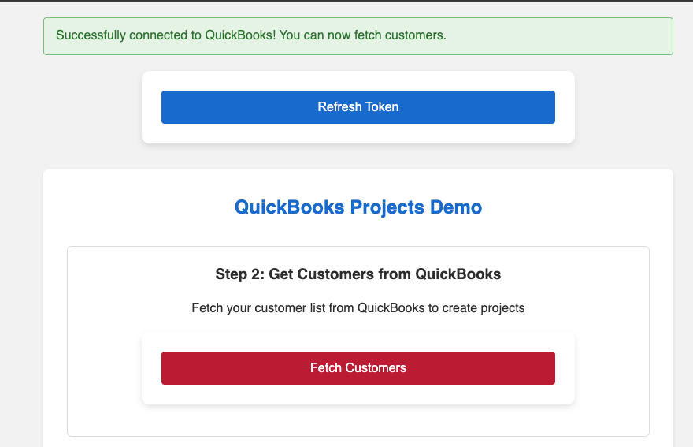
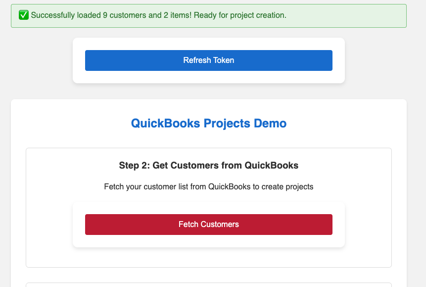
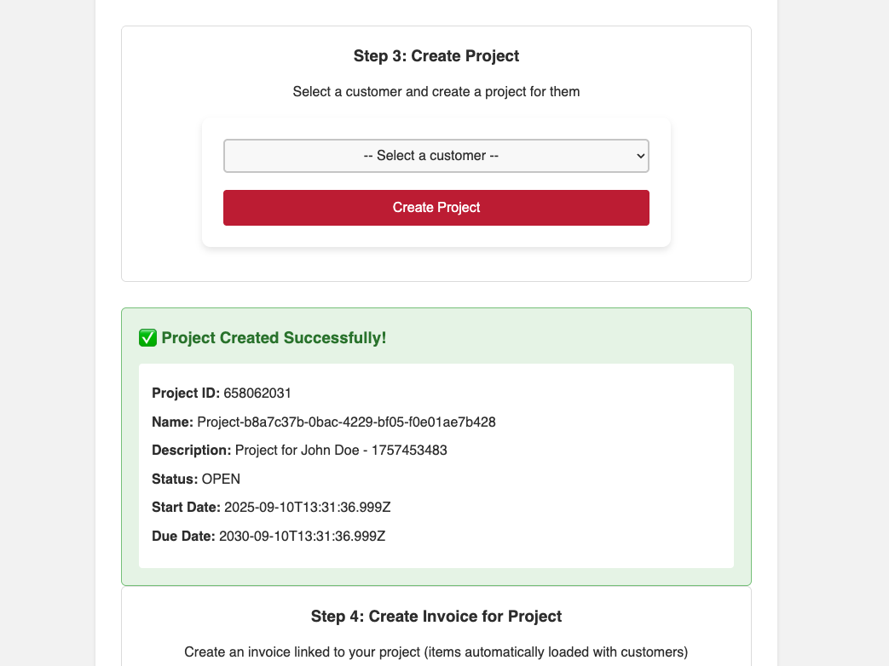
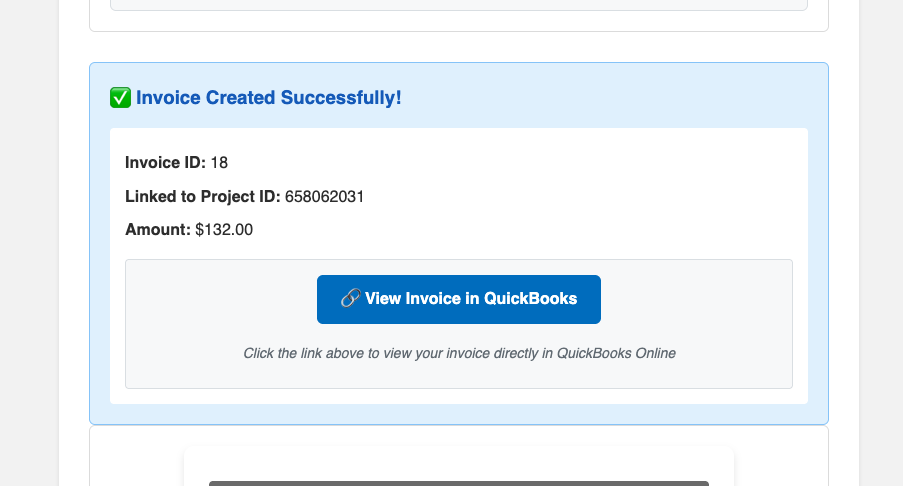
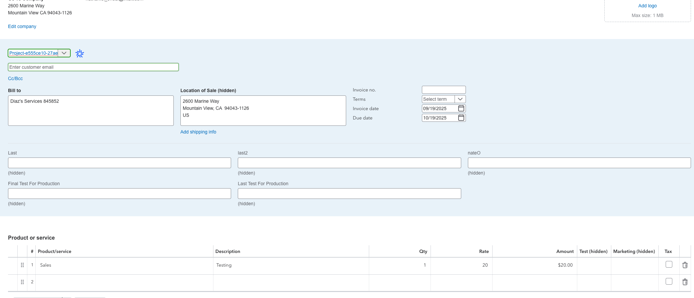

# QuickBooks Projects and Invoicing Sample App (Java)

This is a simple Java Spring Boot application that demonstrates integrating with QuickBooks using OAuth 2.0, creating Projects via GraphQL, and creating Invoices via the Accounting API with deep links back to QuickBooks Online.

## Features

- OAuth 2.0 authentication with QuickBooks
- Project Management API integration (GraphQL)
- Accounting API integration (customers, items, invoices)
- Deep link to view created invoices in QuickBooks Online

## Prerequisites

- Java 17 or higher
- Gradle 7.0 or higher
- QuickBooks Developer account and a QuickBooks Online company
- ngrok (for local development)

## Java environment setup

1) Install Java 17 (Temurin recommended)
- macOS (Homebrew): `brew install --cask temurin@17`
- Windows: Download and install from `https://adoptium.net/temurin/releases/?version=17`

2) Set JAVA_HOME and PATH
- macOS/Zsh (add to `~/.zshrc`):
```bash
export JAVA_HOME=$(/usr/libexec/java_home -v 17)
export PATH="$JAVA_HOME/bin:$PATH"
```
Then run `source ~/.zshrc`.

- Windows (System Properties → Environment Variables):
  - JAVA_HOME = C:\Program Files\Eclipse Adoptium\jdk-17\ (your install path)
  - Add `%JAVA_HOME%\bin` to PATH

3) Verify
```bash
java -version
./gradlew -v | cat
```

4) IDE SDK
- In IntelliJ/VS Code, set the project SDK/JDK to Java 17.

## Dependencies

- Spring Boot Web and Thymeleaf
- QuickBooks Java SDKs: `ipp-v3-java-devkit`, `oauth2-platform-api`, `ipp-v3-java-data` (6.7.0)
- JAXB for Java 17 compatibility: `javax.xml.bind:jaxb-api`, `org.glassfish.jaxb:jaxb-runtime`
- Jackson Databind
- Spring Session Core
- Spring Boot Starter Test (test scope)

### Required OAuth Scopes

- `com.intuit.quickbooks.accounting` — Access accounting data (customers, items, invoices)
- `project-management.project` — Access Projects API

## Setup

1) Clone the repository
```bash
git clone <repository-url>
cd SampleApp-Projects-Java
```

2) Start ngrok
```bash
ngrok http 8080
```

3) Configure your QuickBooks app
- Visit the Intuit Developer Portal (`https://developer.intuit.com/app/developer/myapps`)
- Create an app (or use an existing one)
- Enable the scopes above
- Add your redirect URI (e.g., `https://your-ngrok-url.ngrok-free.app/callback`)

4) Configure application settings

Option A: Use environment variables
```bash
export QB_CLIENT_ID=your_client_id
export QB_CLIENT_SECRET=your_client_secret
export QB_REDIRECT_URI=https://your-ngrok-url.ngrok-free.app/callback
export QB_ENVIRONMENT=production   # or sandbox
export QB_GRAPHQL_URL=https://qb.api.intuit.com/graphql
export QB_BASE_URL=https://quickbooks.api.intuit.com
export QB_MINOR_VERSION=75
export QB_SCOPES="com.intuit.quickbooks.accounting,indirect-tax.tax-calculation.quickbooks"
```

Option B: Use `application.yml` (create at `src/main/resources/application.yml`)
```yaml
server:
  port: 8080

spring:
  application:
    name: quickbooks-sdk-demo
  thymeleaf:
    cache: false
    
quickbooks:
  # INSTRUCTIONS: Copy this block into application.yml and replace with your credentials
  client-id: ${QB_CLIENT_ID:your_quickbooks_client_id_here}
  client-secret: ${QB_CLIENT_SECRET:your_quickbooks_client_secret_here}
  environment: ${QB_ENVIRONMENT:production}  # Use 'sandbox' for development, 'production' for live
  redirect-uri: ${QB_REDIRECT_URI:https://your-ngrok-url.ngrok-free.app/callback}
  base-url: ${QB_BASE_URL:https://quickbooks.api.intuit.com}  # If using sandbox, set to https://sandbox-quickbooks.api.intuit.com
  graphql-url: ${QB_GRAPHQL_URL:https://qb.api.intuit.com/graphql}
  minor-version: ${QB_MINOR_VERSION:75}
  deep-link-template: ${QB_DEEP_LINK_TEMPLATE:https://app.qbo.intuit.com/app/invoice?txnId=%s&companyId=%s}
  scopes:
    - com.intuit.quickbooks.accounting
    - project-management.project

logging:
  level:
    com.quickbooks.demo: DEBUG
    org.springframework.graphql: DEBUG
```

Important: `src/main/resources/application.yml` is intentionally gitignored to prevent leaking credentials. A tracked sample `src/main/resources/application.yml.template` is provided as a reference; copy it to `application.yml` and fill in your real values locally.

5) Run the application
```bash
./gradlew bootRun
```

## Usage

1. Visit `http://localhost:8080`
2. Click "Connect to QuickBooks" to authenticate
3. Click "Fetch Customers/Items" to load data
4. (Optional) Use "Quick Create" to create a Customer or Item directly from the UI
5. Create a Project
6. Create an Invoice linked to the Project and follow the deep link to view it in QBO

## Visual Walkthrough

### 1) OAuth sign-in


### 2) Fetch customers and items


### 3) Create a Project


### 4) Create Invoice and open deep link in QBO


### 5) View Invoice in QuickBooks


## API Endpoints

- `/` — Home page
- `/qbo-login` — Initiates OAuth flow
- `/callback` — OAuth callback handler
- `/call-qbo` — Retrieves customers and items
- `/create-project` — Creates a project (GraphQL)
- `/fetch-items` — Fetches items for the invoice form
- `/create-invoice` — Creates an invoice (Accounting API) with a deep link
- `/logout` — Clears session and logs out

## Common Issues

1) Forbidden (403) or Insufficient Scope
- Ensure both scopes are configured and granted during auth
- Re-authenticate after changing scopes

2) Invalid client or redirect URI
- Verify Client ID/Secret
- Ensure `redirect-uri` exactly matches the app settings in the Developer Portal

3) Environment mismatch
- Make sure `environment` matches the company you are connecting to (sandbox vs production)

4) JAVA_HOME is set to an invalid directory (e.g., `/usr/bin/java`)
- Symptom: Gradle prints `ERROR: JAVA_HOME is set to an invalid directory: /usr/bin/java`.
- Cause: `JAVA_HOME` points to the java launcher, not the JDK folder that contains `bin/javac`.
- Fix (macOS, zsh):
  ```bash
  /usr/libexec/java_home -V                   # list installed JDKs
  export JAVA_HOME=$(/usr/libexec/java_home -v 17)
  export PATH="$JAVA_HOME/bin:$PATH"
  # persist for new shells
  echo 'export JAVA_HOME=$(/usr/libexec/java_home -v 17)' >> ~/.zshrc
  echo 'export PATH="$JAVA_HOME/bin:$PATH"' >> ~/.zshrc
  source ~/.zshrc
  ```
- Using jenv: If you use `jenv`, prefer configuring via jenv instead of manually setting `JAVA_HOME`:
  ```bash
  jenv versions
  jenv global 17
  jenv which java
  echo $JAVA_HOME
  ```
- Linux example:
  ```bash
  # find your JDK install path, then set e.g.
  export JAVA_HOME=/usr/lib/jvm/java-17-openjdk
  export PATH="$JAVA_HOME/bin:$PATH"
  ```
- Windows (PowerShell):
  ```powershell
  setx JAVA_HOME "C:\\Program Files\\Eclipse Adoptium\\jdk-17"
  setx PATH "$($env:JAVA_HOME)\\bin;$env:PATH"
  ```
- Gradle-only fallback: Create `~/.gradle/gradle.properties` with:
  ```
  org.gradle.java.home=/Library/Java/JavaVirtualMachines/temurin-17.jdk/Contents/Home
  ```

### ngrok Troubleshooting

- **ERR_NGROK_8012 (connection refused to upstream)**
  - Symptom: ngrok shows target `http://localhost:3000` but your app listens on 8080.
  - Fix: Start ngrok to 8080: `ngrok http 8080` or change `server.port` to 3000.

- **Wrong redirect URI during OAuth**
  - Ensure `quickbooks.redirect-uri` matches your current ngrok domain and ends with `/callback`.
  - Update `QB_REDIRECT_URI` env var or `application.yml`, and in the Intuit Developer Portal.

- **Tunnel not active / 404**
  - Start ngrok before starting auth, and use the HTTPS forwarding URL in your app config.
  - Confirm the URL in the browser matches the latest ngrok session domain.

- **Mixed environment URLs**
  - Sandbox company requires sandbox base URL: `https://sandbox-quickbooks.api.intuit.com`.
  - Production uses `https://quickbooks.api.intuit.com`.

- **Local firewall/port in use**
  - Verify the app is running: open `http://localhost:8080` directly.
  - If port is busy, change `server.port` in `application.yml` and re-run: `ngrok http <new-port>`.

## Project Structure

```
SampleApp-Projects-Java/
├── src/main/java/com/quickbooks/demo/
│   ├── Application.java
│   ├── config/
│   ├── controller/
│   └── service/
├── src/main/resources/
│   ├── application.yml
│   ├── graphql/
│   ├── static/
│   └── templates/
└── README.md
```

## License

This project is licensed under the Apache License 2.0 — see [LICENSE](LICENSE).

## Support

For support, visit the Intuit Developer Community (`https://help.developer.intuit.com/s/`) or open an issue in this repository.

